# Meatless Munchies - Introduction

**Meatless Munchies** food delivery website is developed using Django Framework as the final project for the Code Institute Bootcamp.

> It is a takeaway places that specialises in **meat-free comfort/junk food**. Customer users can see images and descriptions of the food in the menu page, search through the items and order on the application. The customer side is streamlined and intuitive to navigate for people to order easily even after a night on the town. They are able to chose whether to pay via the paypal api or at the door when their food arrives. Staff users haveto log in and can see the total revenue and orders completed for the day as well as any undelivered orders and mark them as delivered.

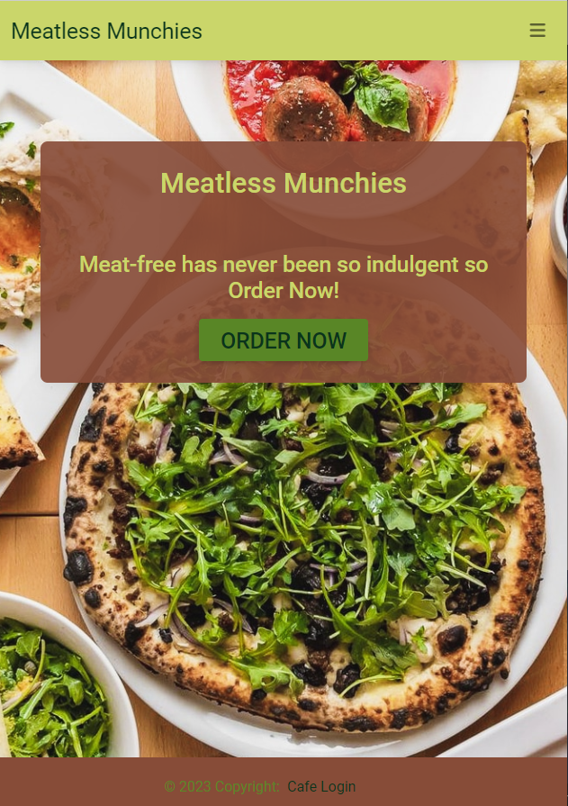
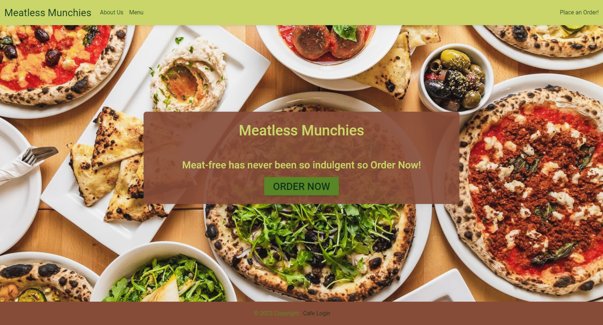

----

## [Content](#content)
- [Meatless Munchies - Introduction](#Meatless-Munchies---introduction)
  - [User Experience - UX](#user-experience---ux)
    - [Site Aims](#site-aims)
    - [Agile Methodology](#agile-methodology)
    - [Epics and User Stories](#epics-and-user-stories)
    - [Tasks](#tasks)
  - [Design](#design)
    - [Colours](#colours)
    - [Imagery](#imagery)
    - [Wireframes](#wireframes)
    - [Database Diagram](#database-diagram)
  - [Features](#features)
    - [Home Page](#home-page)
      - [Navbar](#navbar)
      - [Footer](#footer)
    - [About Page](#about-page)
    - [Menu Page](#about-page)
    - [Order Page](#about-page)
    - [Search Bar](#search-bar)
    - [Checkout Page](#about-page)
    - [Superuser](#superuser)
  - [Technologies Used](#technologies-used)
    - [Languages Used](#languages-used)
    - [Django Packages](#django-packages)
    - [Frameworks - Libraries - Programs Used](#frameworks---libraries---programs-used)
  - [Testing](#testing)
    - [Validation](#validation)
    - [Manual Testing](#manual-testing)
    - [Bugs](#bugs)
    - [Future Implementations](#future-implementations)
  - [Credits](#credits)
    - [Learning Resources](#learning-resources)
    - [Content and Media](#content-and-media)
    - [Acknowledgement](#acknowledgement)

-----

# User Experience - UX

## Site Aims
* Meatless Munchies aims to provide a hearty and delicious late night takeaway food for vegetarians and vegans quickly and efficiently.
* The site should be easy to navigate for tired or intoxicated people.
* This site also aims to provide users with visually pleasing images and mouthwatering descriptions of the food.
* Meatless Munchies aims to fill a gap in the market of comfort food aimed at vegetarian and vegan people.
* Staff users are able to see the orders placed and mark them as delivered and delete orders.
* Customer users can place orders.
* Superusers can create orders, read the data, update if the orders have been paid for and delete orders.

## Agile Methodology

The Agile Methodology was used to plan this project. This was implemented through Github and Trello. Through the use of the Kanban board in Trello, the project was divided into a few different sections: 

* To Do - All the tasks were initially entered in the 'To Do' column.
* In Progress - During development they were moved into the 'In Progress' column to help focus on tasks in a planned order.
* Done - They were then moved into 'Done' once the development on them was complete. this gave a list reference to know if additions made werent considered in the beginning or were implemented wrongly.
* Testing- These held the testing protocols that were added as the project went along.

Please find my Kanban Board with my user stories

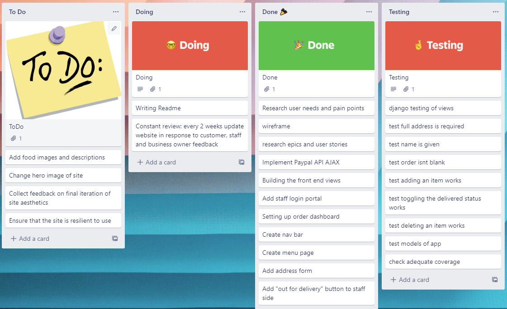

## Epics and User Stories

Following Epics were created which were further developed into several User Stories.

### Epic 1- Website UI
Epic Goals for User- 
* A streamlined User Interface to get to the food and order with minimal hurdles.
* Obvious categories and "top picks of the week" to prevent too many decisions impeding orders.
* Easily know the site sells vegetarian and vegan food.
* Toggle buttons between veganism and vegetarianism and obvious indication of which items are which.
* Search bar for menu items.

#### Related User Stories:
* As a site user I can easily order food even when I am drunk or tired.
* As a site user I can see specific dishes that look tasty so I dont have to look at every dish to make a decision.
* As a site user I can know immediately that I am on the correct site and it is for vegans aswell as vegetarians.
* As a site user I can chose to only see vegan options if I cannot eat non-vegan options.
* As a site user I can use a search bar to search for a specific meal if I already know what I want.

### Epic 2- Staff usability
Epic Goals-
* Easy sign in page for the staff members
* No option for non-staff members to access the backend
* Upon signing in, the staff can see the dashboard with total revenue for the day and number of orders recieved
* Easy access to Update the delivered status of orders
* Removal, from the dashboard, of delivered orders to not clog up the site 

#### Related User Stories:
* As a staff user, I can login to see the orders dashbaord.
* As a site owner, I can prevent the general public from accessing to the dashboard.
* As a staff user, I can find the dashboard intuitively and select through the current orders.
* As a staff user, I can change the data on if the order is delivered.
* As a staff user, I want a clear and informative page that contains all the things I could want to know while working in a busy kitchen.

### Epic 3- Food menu Management
Epic Goals-
* Create/ Update / Read / Delete selected menu items as they come in and out of season.
* View them in the menu and make sure they look delicious.
* Approve and publish nutritional information.

#### Related User Stories:
* As a site owner, I can create planned food drafts so that they can be published on the launch of a new menu day.
* As a site owner, I have complete control over what foods are on the menu.
* As a site owner, I can add nutritional infromation and alergy notices.

## Tasks

The website development process closely followed CI's Django module "I Think Therefore I Blog". The Legion Scripts YouTube series "Building a Food Delivery Web App With Django and Python 3" also outlined some of the key tasks for projects similar to this one.

**Before Project Inception**

- Design ERD and Data 
- Create Repository in GitHub
- Create Project, Epics, User Stories and prepare Kanban Board

**Creation of Project in GitPod**

- Create the Django project
- Create the "cafcafproj" Django project
- Create the "custapp" Django application
- Create the "cafapp" Django application
- Create Database Models
	- Set up models.py file in "custapp" directory
- Create the "custapp" views
 - Index, About, Order
- Set up Templates
	- Create base.html, navigation.html, (Navbar) and footer.html (Footer) content, which gets extended to all the other template files
- Created "custapp" Database Models
  - Including menu item, order and category models
- Set up order, orderconfirmation and orderpayconfirmation templates
  - Adding things like modals in to allow the user to double check what they ordered
- Added views for Orderconfirmation and Orderpay
- Added PayPal API into website
- Install Allauth for sign in, sign up and sign out templates with-  pip3 install django-allauth 
- Implement no new staff users
- Implement bootstrap templates for login and logout pages	
  - Install crispy-forms to add styles to Django account templates with-  pip3 install crispy-bootstrap5
- Create views for "cafapp" (staff side)
  - Dashboard and OrderDetails
- Create templates for "cafapp"
  - Create order_details html and dashboard html
- Added template for menu view for "custapp" including a search feature
- Intensive Manual Testing and Validation checks of each page and codes written
- Final Deployment steps

-----

[Back to top](#content)

# Design

## Colours

Vegetarian and Vegan foods and events seem to have a very consistent theme of green with darkish brown. This is something I want to replicate as it gives the site a consistent and familiar feel. Hopefully instilling confidence in the user that food is cooked by people that love veggie and vegan food.

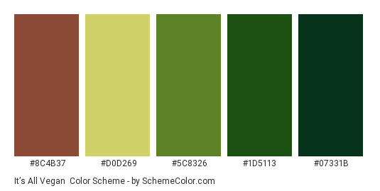

## Imagery

All the imagery is related to or pictures of meat-free food. Ideally making the users mouths water and intice them into ordering food.

## Wireframes

The wireframes for this projected were generated using Figma. 

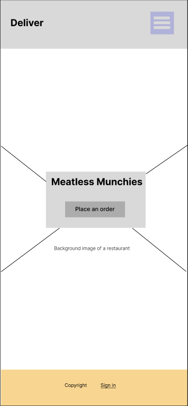
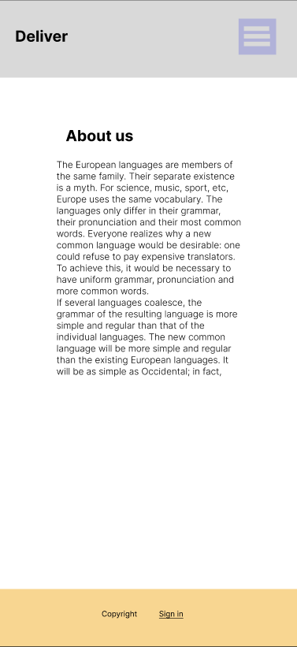
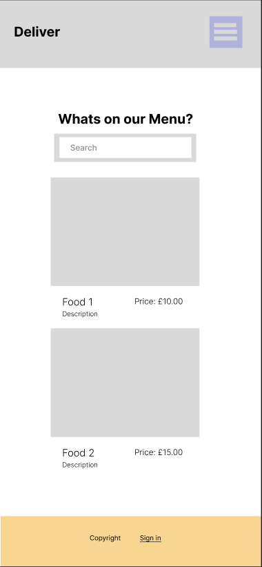
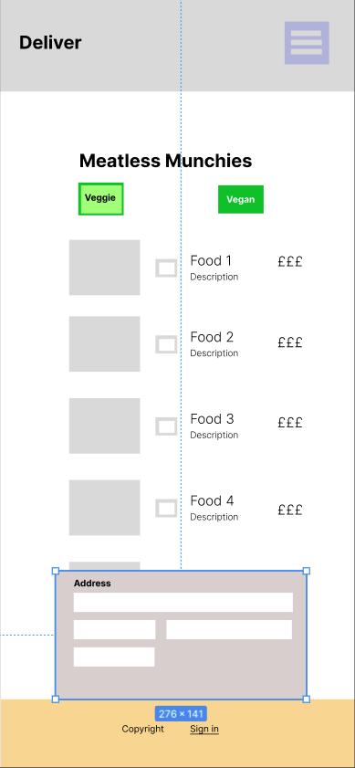
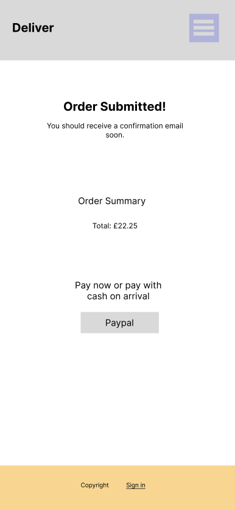
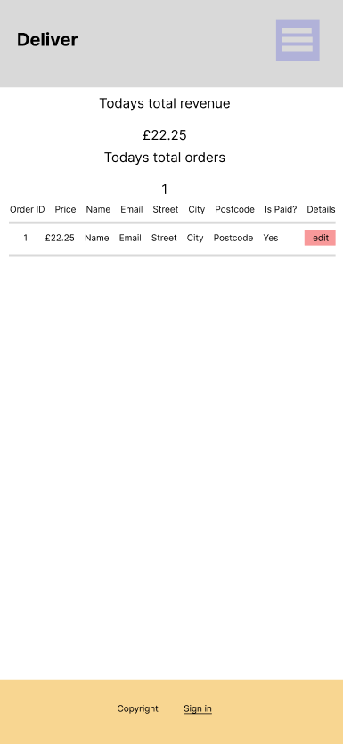

----

## Database Diagram

ERDPlus was used to create a database schema to visualise the types of custom models the project requires. This schema was used as a guide to what needed to be added to each model. Below is the Database structure that this project is based on. The relationship between Order, MenuItem and Category are shown in this diagram.

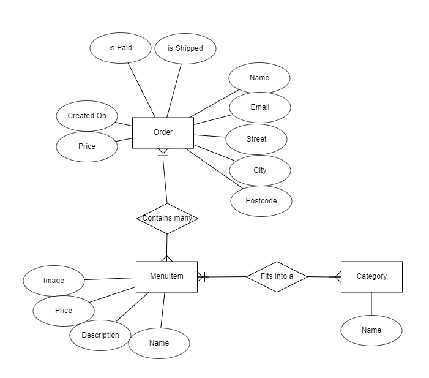

[Back to top ⇧](#content)

----

# Features

## Home Page

The first impression of the site will be clean and professional with the hero image in the background suggesting food is the center of the operation. It has a card positioned at the center of the screen with a large centralised order button. For first time users there are few choices to be made to get to where they will probably want to go.

### Navbar

To keep a consistent site structure the nav bar is at the top of every page. This is the main way to navigate to parallel sections of the site as the main usage of the site will be linear. This declutters the options the user is faced with but still maintains the ease of access which is so crucial to the site.
The nav bar is collapsed on mobile and explicit on larger devices.

### Footer

The footer displays the copyright and a subtle login link for staff members. This is out of the way for most customers but still easily accessible for staff members.

----

## About Page

Since the customer base is very ethical and choice conscious, it is very important to have an about section that explains who we are and what we aim to do. Additionally having this information there can instill confidence in the customers. While this page will often not be accessed by every user it is still crucial to display this information openly.

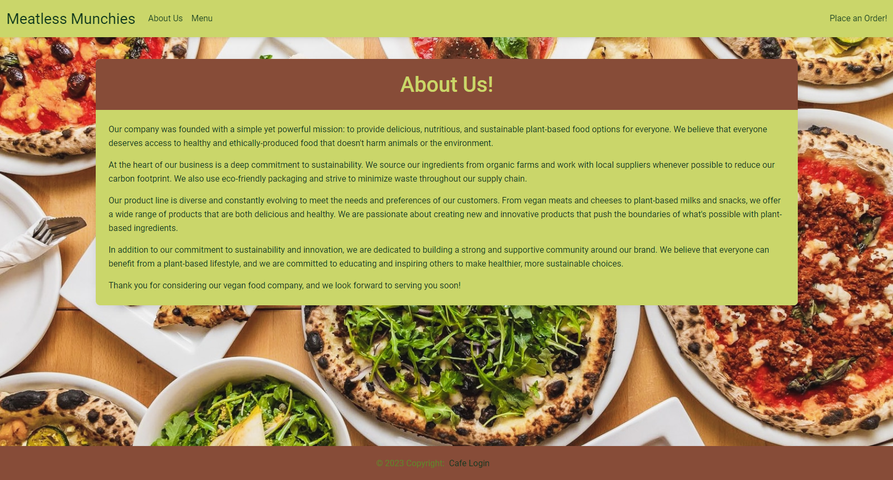

----

## Menu Page

If someone is wanting to try a new food this menu page is there to display everything offered and has a search bar to find what you're looking for quickly. Additionally this page will have allergy information and the main ingredients list for more niche denominations like lacto-ovo-vegetarians to decide whether they can eat it or not.
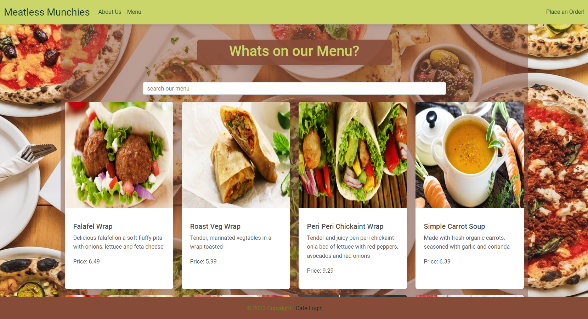

### Search Bar

To allow for fast search or searching for products related to other products.

## Order Page

The order page displays the food in a linear fashion so that customers can decide which products they do or dont want with the address form at the bottom. This streamlines the ordering process so they can get their order sent quickly and hastle free.
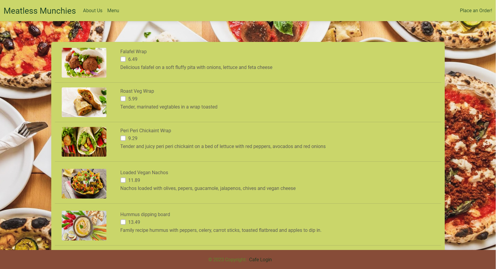
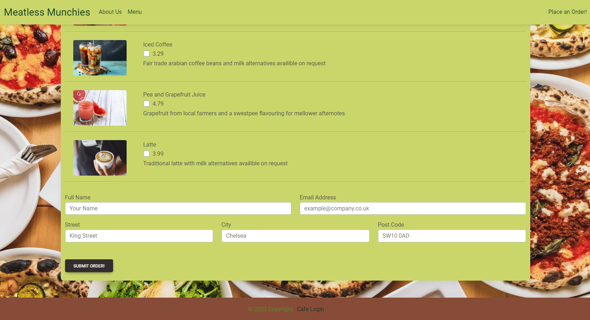

## Checkout Page

This is where the paypal api button sits and shows an overview of the order including the food ordered and the total incase anything has been added or missed off by mistake. Again it is a very clean design to not distract from the utility of the website.

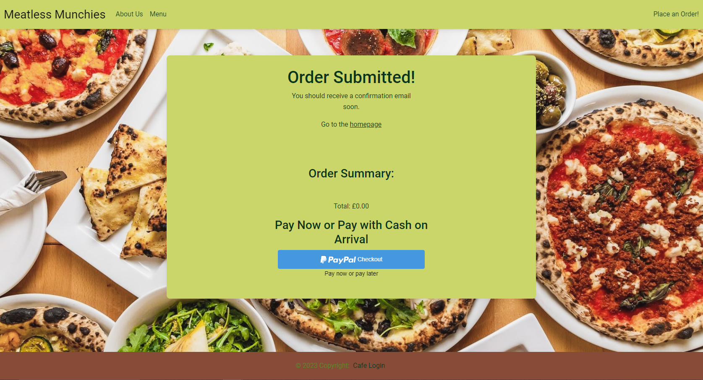

Additionally there is a pay confirmation site that just says thank you for paying but is there to give visual feedback to the customer that they have successfully paid.

----

## Superuser

The superusers can log in through the staff portal (seen below) and can create, read, update and delete all of the orders and menu items.

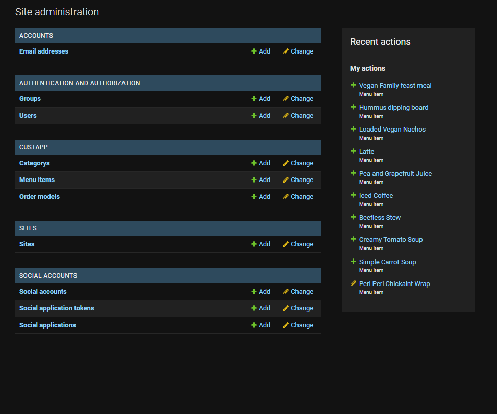

### Admin 'MenuItem' Model Management

On creating a new MenuItem the superuser can add a name, description, price, photo and category. This is then rendered on the menu and order page the next time it is loaded.

### Admin 'Order' Model Management

Orders are generated by the user and saved down. They can be generated by the admin but in most use cases this is not what happens. The user submitting an order records what items they want and inputs their address. Automatically, the price is generated and the is-paid and is-delivered are set to false. The is-delivered can be changed by staff members via the dashboard when the order has been sent off.

# Technologies Used

## Languages Used

* [HTML 5](https://en.wikipedia.org/wiki/HTML/)- Used to structure all the templates on the site
* [CSS 3](https://en.wikipedia.org/wiki/CSS)- to provide extra styling to the site
* [Python](https://www.python.org/)- To provide the functionality to the site. Packages used in the project can be found in requirements.txt
* [JavaScript](https://www.javascript.org/)- To link up add the paypal api button.

## Django Packages

* [Psycopg2](https://pypi.org/project/psycopg2/)- As an adaptor for Python and PostgreSQL databases.
* [Allauth](https://django-allauth.readthedocs.io/en/latest/installation.html)- For authentication, registration, account management.
* [Crispy Forms](https://django-crispy-forms.readthedocs.io/en/latest/)- To style the forms.

## Frameworks - Libraries - Programs Used

* [Django](https://www.djangoproject.com/) was used as the framework for the back-end logic of the project. Django enables rapid and secure development.
* [Bootstrap](https://getbootstrap.com/)- Used to style the website, add responsiveness and interactivity.
* [Git](https://git-scm.com/)- Used for version control by utilizing the Gitpod terminal to commit to Git and push to GitHub.
* [GitHub](https://github.com/)- Used to store the project's code after being pushed from Git.
* [PostgreSQL](https://www.postgresql.org/)- Database used through heroku.
* [Figma](https://www.figma.com/)- To build the wireframes for the project.
* [Google Chrome Developer Tools](https://developers.google.com/web/tools/chrome-devtools) was used to inspect page elements, debug, troubleshoot and test features and adjust property values. Using the Lighthouse extension installed in Chrome Browser, the performance report was generated.
* [Font Awesome:](https://fontawesome.com/) was used to add icons for aesthetic and UX purposes.
* [Visual Studio Code](https://code.visualstudio.com/)- As a text editor.
-----

[Back to top ⇧](#content)

# Testing

## Validation

I used the following validation tools to validate HTML, CSS, PYTHON codes. Validation results below:  
- HTML using [W3C HTML validator](https://validator.w3.org/)
- CSS using [Jigsaw CSS validator](https://jigsaw.w3.org/css-validator/)
- Python via [PEP8 CI Python Linter](https://pep8ci.herokuapp.com/)

## Manual Testing

Testing has taken place continuously throughout the development of the project. With each feature being added then checked to be working before moving on. 

----

## Bugs

| **Bug** | **Fix** |
| ----------- | ----------- |
| In navbar, the menu burger button did not appear | pls fix this jack :) |
| My images were not loading | I realised this was a mistake in the file paths and corrected it |
| Staff group didnt exist and I thought the allauth staff was this group | Created group through the admin panel |

## Future Implementation

* Undo button for is-delivered 
* A way to order multiple of one item

[Back to top ⇧](#content)

# Credits

## Learning Resources

Youtube videos by [Legion Script](https://www.youtube.com/@LegionScript)
[W3CSchool](https://www.w3schools.com/django/)
Bootstrap documentation [Bootstrap](https://getbootstrap.com/docs/4.3/components/navbar/)
[Django Documentation](https://docs.djangoproject.com/en/3.2/ref/models/fields/#field-types)(For different quaries while doing project. For example query about models, fields, form widgets, auth and many more)
Youtube videos [The Dumbfounds](https://www.youtube.com/playlist?list=PLbpAWbHbi5rMF2j5n6imm0enrSD9eQUaM) for automated testing.

## Content and Media

Images were taken from Pexels and Canva

## Acknowledgement

Special thanks to all of the technical coding support provided by Richey Malhotra and all of the literary support and guidance by Rosie Jones!

[Back to top](<#content>)
   
